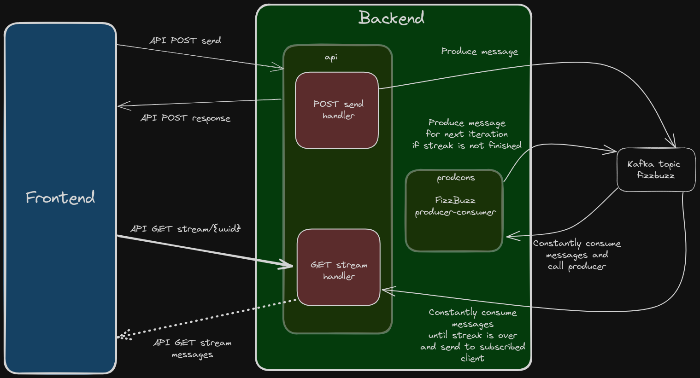

# Overly-Complex Designed FizzBuzz

Overly-Complex Designed FizzBuzz (OCD FizzBuzz for short, pun intended) is a small project built as a means to practice with golang and server sent events.

## The FizzBuzz problem

Everyone in the software developer community knows what FizzBuzz is. The FizzBuzz problem states something like the following.

> "Given a positive non zero integer number n, print for each number k from 1 to n the string "Fizz" if k is an integer multiple of 3, the string "Buzz" if k is an integer multiple of 5 and the string "FizzBuzz" if k is an integer multple of both 3 and 5."

## Overly-Complex Design

What if... what if, instead of doing all of this in a loop from 1 to n, we leavareged the power of Apache Kafka?

"But you are using a loop to read from kaf-"

Shus, that's not important now!

Here's the design schema.

### Backend

The backend part is composed of two main actors:

- prodcons - The component responsable for consuming messages from the Kafka topic named "fizzbuzz" and publish a new message on the same topic with an incremented value and a the message string attached to it. The publishing is artificially delayd to 1 second for each message to simulate super high data volumes.
- api - The component that exposes the 2 endpoints /send and /stream/{:uuid}

Here's an overview of the two API endpoints:

- /send - POST endpoint that accepst a fizzbuzz message json, generates a uuid for it and publishes it to the Kafka topic named "fizzbuzz". After having published the message, it responds with the fizzbuzz message with the uuid.
- /stream/{:uuid} - GET endpoint that starts a new consumer with the consumergroup derived from the uuid itself (the uuid without the dash characters). This consumer reads the whole topic and filters out messages that have a different uuid than its group id. The rest of the messages are written to a channel where are picked up from the main process and streamed to the client. When the message read is the last one (meaning that k has same value as n) the connection is closed.

A good chunk of the Kafka integration was copy-pasted from the [sarama](https://github.com/IBM/sarama) package examples.

### Frontend

The frontend is a basic React application. The connection state could have been handled in a better way, I know, but the frontend was not the main focus of this... this abomination.

Basically the web ui makes a POST request to /send with the target value. Upon receiving a response, it opens a connection with the server with a GET to /strseam/{:uuid} where the uuid is the one received from the previous POST request.

On every message received, it updates the list of messages that are then displayed in the box on the right (see the demo.gif).

## Run the thing

To run this you are going to need

- docker (with docker compose) to run Apache Kafka 3.6. If you have other means to run Kafka, you don't need docker. I'm using the docker-compose.yaml file I "borrowed" from [here](https://raw.githubusercontent.com/bitnami/containers/main/bitnami/kafka/docker-compose.yml) (thank you VMware, very cool) and edited.
- golang (version 1.21)
- node v18.12.1

Start Kafka, the frontend, the api.go process and the prodcons.go process.

Once you have done it, go to the web ui, type "90" and press the "Click me" button, then play the theme song from "2001: A Space Odissey".

Here's a demo up to 15. The bottom left terminal is running the [api.go](backend/cmd/api/api.go) program, while the bottom right terminal is running the [prodcons.go](backend/cmd/prodcons/prodcons.go).

## But why?

    - Why do you guys do stuff like this?
    - 'Cause it's fun.

\- Community, season 1, episode 12 end credit scene